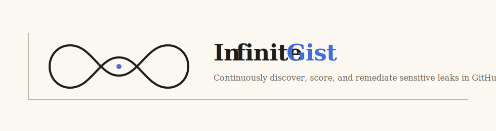

  

## Overview

Infinite Gist is a developer-focused security product for finding exposed credentials, internal code, and risky fragments shared through GitHub Gists. It is designed to help developers and engineering teams detect issues quickly, understand what was exposed, and remediate with confidence.

The product focuses on trustworthy results, transparent audit trails, and minimal-friction workflows. Rather than trying to do everything at once, Infinite Gist starts with a narrow and credible detection loop, then expands into remediation and continuous monitoring.

## Why it exists

GitHub Gists are easy to share and easy to forget. That makes them a real source of accidental exposure for secrets, internal snippets, and risky fragments that can remain visible longer than intended.

Infinite Gist exists to reduce that risk by giving users visibility into what is exposed, how severe it is, where it appeared, and what to do next.

## What it does

### Detection
- Authenticate with GitHub using least-privilege access
- Enumerate accessible Gists
- Scan current Gist files for secrets, credentials, keys, tokens, and risky fragments
- Traverse accessible revision history to detect past exposure
- Classify findings using deterministic rules such as regex and entropy checks

### Risk and evidence
- Assign severity levels to findings
- Distinguish credential exposure from informational leakage
- Tag findings with file, line context, and revision metadata
- Preserve masked evidence for audit-safe review

### Workflow
- Store findings with timestamps and metadata
- Maintain an audit trail of detection and remediation events
- Display findings in a minimal dashboard with severity, status, and filters

## Design principles

- Trustworthy results over opaque magic
- Deterministic detection before complex automation
- Recommendation-first remediation
- Minimal encrypted metadata
- Auditability by default
- Web-first experience for broad accessibility

## Current scope

### In scope for v1
- GitHub OAuth
- User-level Gist discovery
- Current-content scanning
- Revision-history scanning where accessible
- Severity scoring
- Findings persistence
- Minimal findings dashboard
- Audit-safe masked evidence display

### Out of scope for v1
- Full repository scanning
- IDE or plugin integrations
- Broad enterprise policy engines
- Full secret rotation integrations
- Complex billing
- Real-time copilots

## Roadmap

| Phase | Focus |
|---|---|
| 1 | Foundation: auth, enumeration, scanning, severity scoring, persistence, dashboard, masked evidence |
| 2 | Credible detection: stronger secret scanning, confidence scoring, better historical coverage, temporal analysis |
| 3 | Remediation: make private, delete, rotate secrets, verify fixes, notifications, rollback basics |
| 4 | Continuous operation: recurring scans, digests, account-level settings, posture trends, opt-in automation |

## Tech direction

- Detection engine: Python
- Web application: Node.js + React
- Priority: secure handling of findings and masked evidence
- Constraint: scans should complete within a practical user-facing window
- Dependency to design around: GitHub API rate limits

## Status

This project is in early definition and build planning. The first milestone is a credible, explainable detection loop that can validate core value quickly before deeper remediation and automation layers are added.

## README structure

Planned repository sections may include:

- `README.md` for product overview
- `docs/` for design notes and deeper specifications
- `assets/` for visuals and branding
- `backend/` for detection and service logic
- `frontend/` for the web interface

## Contributing

This project is currently evolving rapidly. Contributions, feedback, and design discussion should stay aligned with the core priorities: accurate detection, safe evidence handling, explainability, and developer trust.

## License

TBD
