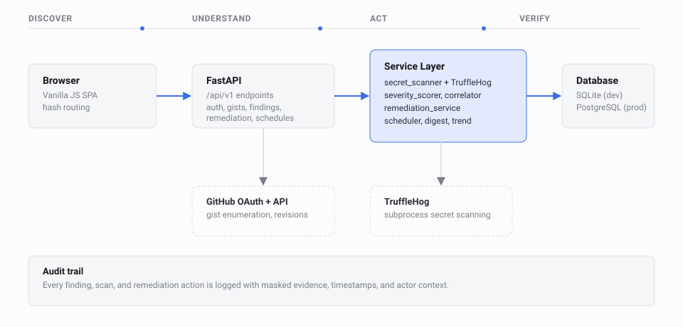

# Infinite Gist

<p align="center">
  
</p>

**Security monitoring and remediation platform for GitHub Gists**

[](https://www.python.org/downloads/)
[](LICENSE)

---

## What It Does

Infinite Gist continuously discovers, scores, and remediates sensitive leaks and risky fragments in GitHub Gists. It gives developers and security teams visibility into exposed credentials, internal code, and risky snippets.

**Core loop:** Discover -> Understand -> Act -> Verify



---

## Features

- **Secret Detection**: Scans Gists for AWS access and secret keys, GitHub tokens, Slack tokens, SSH and PEM private keys, generic API keys, and passwords — plus PII patterns for emails, credit-card numbers, and national ID numbers
- **Severity Scoring**: Confidence-based risk assessment with cross-Gist correlation and temporal analysis
- **Remediation**: Replace a public Gist with a secret Gist, delete it, or generate a provider-agnostic rotation checklist — replacement and deletion are re-verified against GitHub afterwards
- **Audit Trail**: Complete logging of all security events
- **Scheduled Scans**: Daily, weekly, or custom cron schedules, with opt-in auto-remediation policies
- **Evidence Masking**: A finding persists only a masked value and a keyed hash — the model has no raw-secret column, and a migration removed the original raw-content storage

---

## Quick Start

```bash
git clone https://github.com/AgenticJennifer/infinite-gist.git
cd infinite-gist
cp .env.example .env
# Fill in SECRET_KEY, ENCRYPTION_KEY, GITHUB_CLIENT_ID, and GITHUB_CLIENT_SECRET in .env
docker compose up -d
```

The dev stack starts the API and a PostgreSQL 16 container; the API container runs `alembic upgrade head` before serving. Open `http://localhost:8000` after the containers start. Interactive API docs are at `http://localhost:8000/docs`.

Required `.env` variables:

| Variable | Description |
|----------|-------------|
| `SECRET_KEY` | Secret for JWT signing — generate with `openssl rand -hex 48` |
| `ENCRYPTION_KEY` | Fernet key for GitHub-token encryption — generate with `openssl rand -base64 32 \| tr '+/' '-_' \| tr -d '\n'` |
| `GITHUB_CLIENT_ID` | From your GitHub OAuth App |
| `GITHUB_CLIENT_SECRET` | From your GitHub OAuth App |

If `SECRET_KEY` or `ENCRYPTION_KEY` is left unset, the app generates a random one at startup and logs a warning — existing JWTs and previously encrypted tokens will not survive a restart.

---

## API Endpoints

All routes are mounted under `/api/v1`. A selection of the surface — see `/docs` for the full generated reference.

| Method | Endpoint | Description |
|--------|----------|-------------|
| `GET` | `/api/v1/auth/github/login` | Start the GitHub OAuth flow |
| `GET` | `/api/v1/auth/users/me` | Current authenticated user |
| `POST` | `/api/v1/gists/scan/account/{github_account_id}` | Scan a connected GitHub account |
| `GET` | `/api/v1/gists/gists` | List the user's Gists |
| `GET` | `/api/v1/gists/findings` | List findings |
| `GET` | `/api/v1/gists/findings/stats` | Finding statistics |
| `PUT` | `/api/v1/gists/findings/{finding_id}/status` | Update a finding's status |
| `POST` | `/api/v1/gists/triage` | Batch-triage findings |
| `GET` | `/api/v1/gists/correlations` | Secrets correlated across Gists |
| `GET` | `/api/v1/gists/gists/{gist_id}/temporal` | Temporal exposure analysis for a Gist |
| `POST` | `/api/v1/remediation/replace-with-secret` | Replace a public Gist with a secret Gist (rate-limited) |
| `POST` | `/api/v1/remediation/delete` | Delete a Gist (rate-limited) |
| `POST` | `/api/v1/remediation/rotate` | Generate a rotation checklist (rate-limited) |
| `GET` | `/api/v1/remediation/` | Remediation action history |
| `POST` | `/api/v1/schedules/` | Create a scan schedule |
| `GET` | `/api/v1/policies/` | Read account policy settings |
| `GET` | `/api/v1/trends/summary` | Security-posture summary |
| `GET` | `/api/v1/digests/` | List generated digests |

Remediation endpoints take a JSON body, not query parameters:

```json
{ "finding_id": 1 }
```

`replace-with-secret` additionally requires `"confirm_url_and_history_change": true`, because replacing a public Gist with a secret one changes its URL and drops its revision history.

Every route above except `/api/v1/auth/github/login` requires an authenticated session, and state-changing requests made with the session cookie must also carry a matching `X-CSRF-Token` header.

Unauthenticated health check: `GET /health`.

---

## Project Structure

```
infinite-gist/
├── .github/workflows/ci.yml    # lint, tests, Postgres migrations, MVP, frontend, pyright
├── .planning/                  # PROJECT, REQUIREMENTS, ROADMAP, STATE
├── alembic/                    # Migration env and versions/
├── docs/                       # Architecture diagram, logo, original PRD
├── mvp/                        # Earlier standalone MVP: own app, deps, and tests
├── src/
│   ├── backend/
│   │   ├── api/v1/endpoints/   # FastAPI routers: auth, gists, remediation,
│   │   │                       #   schedules, policies, digests, trends
│   │   ├── core/               # Config, security, logging, rate limiting
│   │   ├── db/                 # SQLAlchemy models and session
│   │   ├── middleware/         # Security headers, CSRF, request size limit
│   │   ├── schemas/            # Pydantic request/response models
│   │   ├── services/           # Scanning, scoring, correlation, remediation
│   │   ├── tasks/              # Periodic scan runner
│   │   └── main.py             # App entry point
│   └── frontend/               # Vanilla JS single-page app, no build step
├── tests/                      # Pytest suite
│   └── frontend/               # node:test suite for src/frontend/app.js
├── alembic.ini
├── Dockerfile
├── docker-compose.yml          # Dev stack: API + PostgreSQL 16
├── docker-compose.prod.yml
├── DESIGN.md                   # Design tokens and theme
├── PRODUCT.md                  # Product requirements
├── SECURITY.md                 # Threat model and security posture
├── CHANGELOG.md
├── requirements.txt            # Runtime deps (requirements.lock pins them)
└── requirements-dev.txt        # Adds ruff, pytest, pyright
```

---

## Tech Stack

- **Backend:** FastAPI, SQLAlchemy 2, Pydantic
- **Database:** SQLite by default; PostgreSQL 16 in Docker and CI
- **Migrations:** Alembic
- **Auth:** GitHub OAuth 2.0, JWT (HS256) in an HttpOnly cookie, double-submit CSRF tokens
- **Scanning:** Custom regex detectors + [TruffleHog](https://github.com/trufflesecurity/trufflehog)
- **Encryption:** Fernet (AES-128-CBC with HMAC-SHA256) for GitHub tokens at rest
- **Frontend:** Vanilla JS, no bundler and no runtime npm dependencies

---

## Development

Local setup without Docker:

```bash
python3 -m venv .venv && source .venv/bin/activate
pip install -r requirements-dev.txt   # runtime deps + ruff, pytest, pyright
cp .env.example .env
alembic upgrade head                  # defaults to sqlite:///./infinite_gist.db
uvicorn src.backend.main:app --reload
```

### Run Tests

```bash
# Python suite. pytest.ini sets testpaths=tests and pythonpath=., so
# `src.backend` imports resolve without installing the package.
pytest -q

# Dependency-free frontend tests (Node.js 20+; package.json declares no deps,
# so no `npm install` is needed).
npm run test:frontend

# The historical MVP has its own isolated suite and its own requirements.
cd mvp && pip install -r requirements.txt && pytest -q
```

### Run Linter

```bash
ruff check src/
ruff format --check src/   # CI enforces this too
pyright                    # config in pyrightconfig.json, scoped to src/backend
```

### Database Migrations

```bash
alembic upgrade head
alembic revision --autogenerate -m "description"
```

`alembic/env.py` reads `DATABASE_URL` from the application settings, so no URL is set in `alembic.ini`.

---

## Security

### Reporting Vulnerabilities

Please report security issues privately via [GitHub Security Advisories](https://github.com/AgenticJennifer/infinite-gist/security/advisories/new). See [SECURITY.md](SECURITY.md) for the threat model.

### Design Principles

- **Secrets are masked:** Findings store masked evidence and HMAC fingerprints, not raw values
- **Audit logging:** All actions are logged with timestamps
- **Ownership checks:** Findings and remediation targets are resolved through a join on the owning Gist and rejected when they belong to another user; `tests/test_security_review_regressions.py` covers the IDOR regressions
- **Encrypted storage:** GitHub tokens are Fernet-encrypted at rest
- **Rate limiting:** Remediation endpoints are rate-limited per user

---

## Status

**Backend: complete.** All four phases in [`.planning/ROADMAP.md`](.planning/ROADMAP.md) — Foundation, Credible Detection, Remediation, and Continuous Operation — are marked complete there. CI runs lint, the Python suite, a PostgreSQL migration check, the MVP suite, the frontend suite, and Pyright on every push and pull request to `main`.

Checks as of the last update to this file — re-run them yourself, the commands are the source of truth:

| Check | Command | Result |
|-------|---------|--------|
| Python suite | `pytest -q` | 213 passed, 1 skipped |
| Frontend suite | `npm run test:frontend` | 14 passed, 0 failed |
| MVP suite | `cd mvp && pytest -q` | 7 passed |
| Lint | `ruff check src/` | All checks passed |
| Types | `pyright` | 0 errors, 0 warnings |

The single skipped test is `tests/test_postgres_smoke.py`, which needs a live PostgreSQL `DATABASE_URL`; CI runs it in the `migrations-postgres` job. There is no coverage-percentage gate — the suite is organised by behaviour, covering masked evidence, HMAC fingerprints, cross-Gist correlation, temporal analysis, severity scoring, remediation flows, and API ownership/authorization regressions.

**Frontend: functional and tested.** `src/frontend/` is a vanilla JS single-page app served by FastAPI at `/`, with an `aria-live` status region, labelled icon controls, `aria-sort` state on sortable tables, and `role="dialog"`/`aria-modal` semantics on modals. The dependency-free `node:test` suite in `tests/frontend/` covers API URL building, HTML escaping, duplicate-submission guarding, same-origin credentials, double-submit CSRF tokens, server and application error envelopes, unauthorized cleanup and redirect, malformed-JSON rejection, cookie-based session restore, the absence of bearer-token persistence, and the severity/confidence rendering helpers.

---

## Roadmap

- [ ] UI polish and onboarding refinements
- [ ] Secret rotation integration
- [ ] Slack/email notifications
- [ ] Team collaboration features
- [ ] Custom detection rules
- [ ] Webhook integrations

---

## License

MIT License. See [LICENSE](LICENSE) for details.

---

## Acknowledgments

- Built with [FastAPI](https://fastapi.tiangolo.com/)
- Secret detection powered by regex patterns and [TruffleHog](https://github.com/trufflesecurity/trufflehog)
- Design inspired by developer-first security tools
